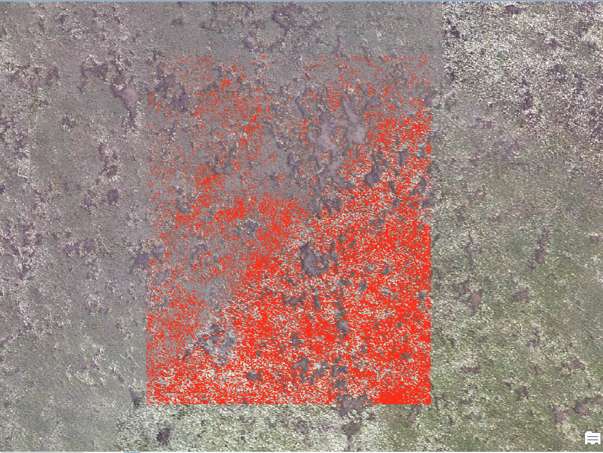

# Eelgrass Classification Pipeline

This slideshow outlines the GIS preprocessing and classification steps for identifying eelgrass using satellite imagery and machine learning.

---

## Step 1: Collect Ground Truth Points

Use GIS platform to digitize labeled points:

- Class `1` = Eelgrass  
- Class `0` = Non-eelgrass

Save them as shapefiles or CSV with field `G_Code`.


## Step 2: Extract Band Data From Imagery

Use GIS software to extract band imagery data from 3 band aerial imagery at each point and save as `Band_1`, `Band_2`, and `Band_3`.


---

## Step 3: Train the Classifier

Use the provided Python scripts and `scikit-learn` to train a model (Random Forest).

```bash
python Train_RandomForest.py

## Step 4: Classify Raster Tiles

Classify eelgrass presence per tile using: 

```bash
python Eelgrass_RandomTrees_Final.py

## Step 5: Evaluate Results

Add output raster into GIS platform and evaluate results as needed.




